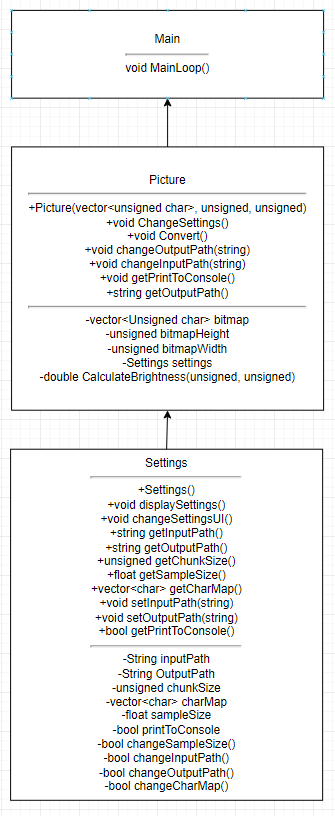
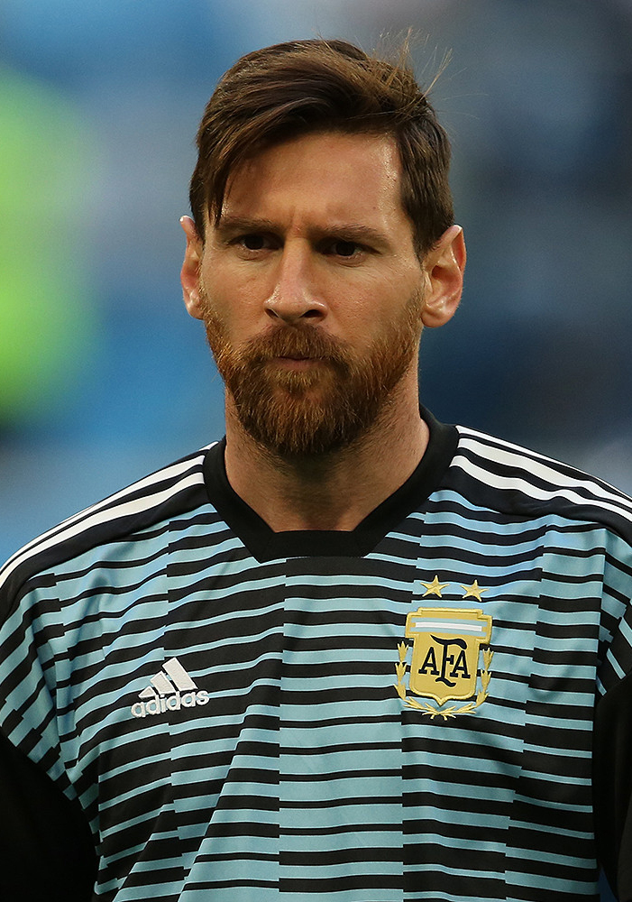
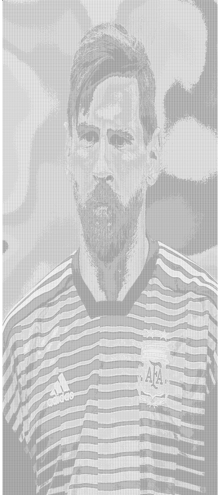
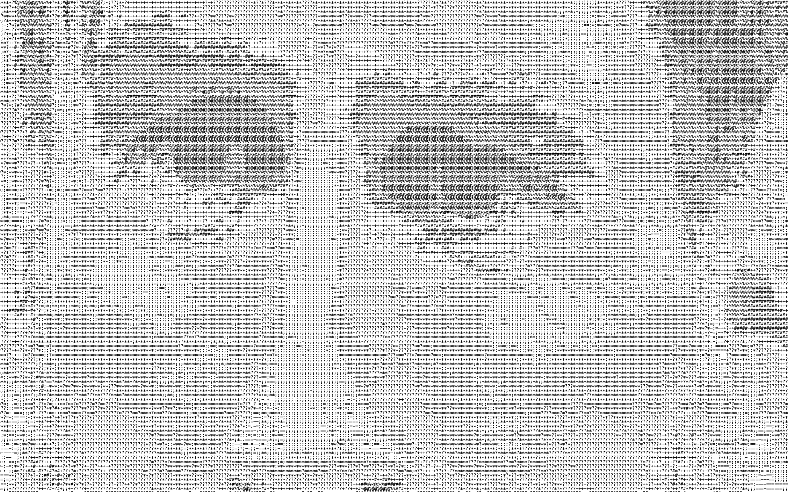
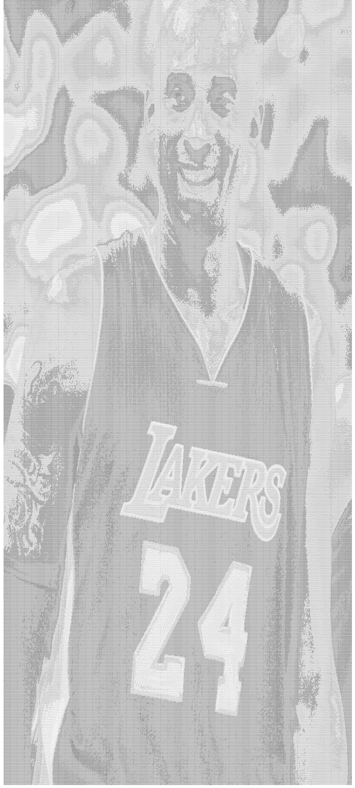
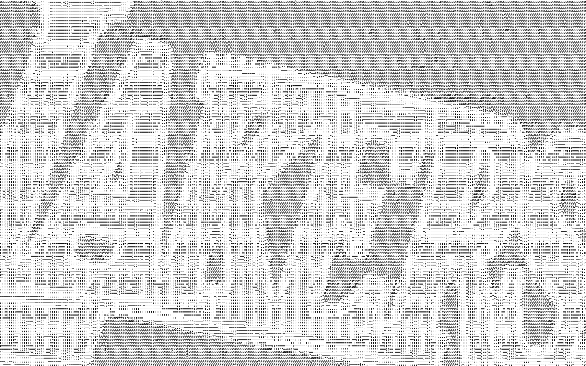
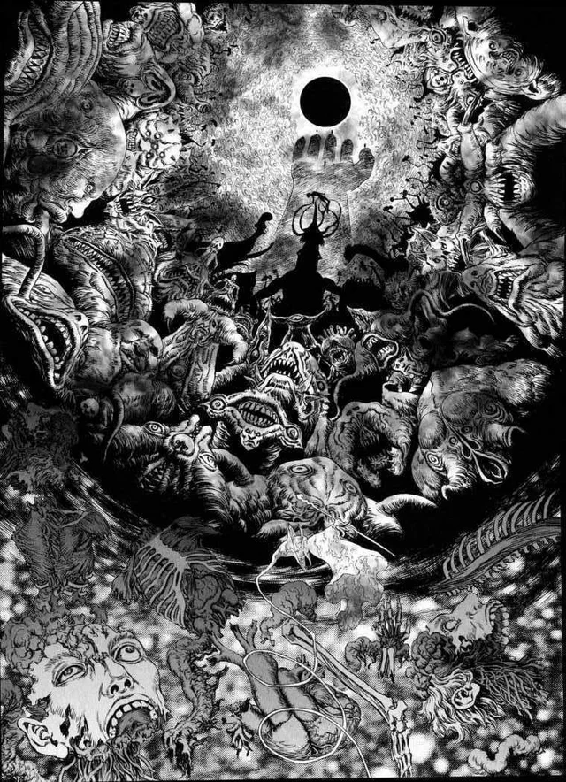
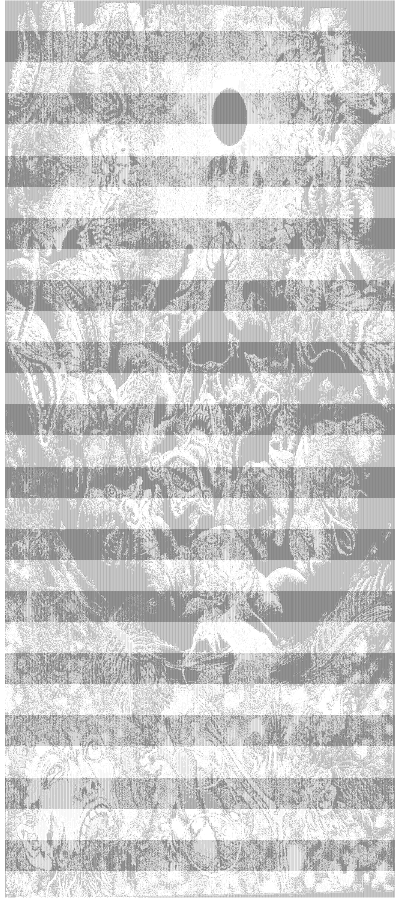

[](https://classroom.github.com/online_ide?assignment_repo_id=8942396&assignment_repo_type=AssignmentRepo)

<p align="center">
  
</p>

## Project Description
**Why is it important or interesting to us?**
 
While our group was proposing ideas for our project, we found that we had a common interest in machine learning. We wanted to learn more about image processing - the way computers algorithmically process pictures - and so we decided to try our hand at building an ASCII art generator. In essence, it would be an application that takes in image files, decides what ASCII characters can be used to represent that image, prints out that ASCII art in the terminal, and also creates a text file containing the newly generated artwork. We believe that this project would be a great first foray into image processing, and we’d be able to learn a lot about the way computers visualize digital images. 

**What languages/tools/technologies do we plan to use?**

There are a lot of tools out there for us to use in this project. With some research we came across a bunch of libraries and tools and technologies we can use to assist in our project. The first tool we could look into is an image processor, which there are many libraries that could help us not only take in an image, but parse through that data. Another tool we can use is knowledge about the RGB colorspace, this would allow us to be able to basically tell the computer what ascii characters go with what pixel RGB value. This would have to come over time, but after more research we believe that we can get enough knowledge to make a complete project. In the end, we believe that we can make this project with minimal dependencies and make it lightweight and efficient.

**What will be the input/output of our project?**

The input of the project will be various png files that our program takes in. The output of our program will be the same image shown as a combination of various ASCII characters that our program will determine to best show the image. We want to write the image created with these characters to a txt file which we can then give the user access to open and see the image that our program has generated. An alternative option would be to just output the characters that create that image into the terminal itself.

**What are the features that our project provides?**

Our project’s goal is to bridge the gap between what is “art” and “computer science”. It is common for computer science students to become disconnected from art, and our goal is to connect the two rather than make them separate. Although it may seem like a gimmick that’s fun for a short period of time, in the end, this could expose the user to look more into art and inspire them to do more artistic creations with computer science.

 > ## Phase II 
 
## Class Diagram



We will have 2 classes that will encapsulate our project and a main which compiles into our executable.

Picture class is the main class that handles the conversion of the photo.

It will be comprised of:

- Settings: this is a settings object that we would be using in various other functions (For further information see settings object)

- Picture Bitmap: is a vector of unsigned chars this is how our bitmap is represented

- Bitmap width: is an unsigned int that is the width of our image

- Bitmap height is an unsigned int that is the height of our image


Our picture class has a few functions that define the functionality of this class.

-CalculateBrightness(), calculates the (relative) brightness of a pixel this will be used in the convert function

- changeSettings(), uses our settings object ui to change settings

- convert(), converts the picture to ascii


Settings class is a class that stores the setting for the picture class, thus it is important for our picture class

It will be comprised of:

- Input path: is a string of the input path of original png

- Output path: is a string of the output path for new image

- Character map: is a vector or characters sorted from most bright to least bright

- Chunk size: is an unsigned int that decides the amount of pixels in the image that is replaced by ASCII characters

- Sample size: is a float that changes the sample size, this would be used to calculate brightness of pixels


The settings class would have a few function that would control the settings:

- ChangeSampleSize(), changes sample size and input validates

- ChangeInputPath(), changes input path and input validates

- ChangeOutputPath(), changes output path and input validates

- ChangeChunkSize(), changes chunk size and input validates

- ChangeCharMap(), changes char map and input validates

- DisplaySettings(), displays all settings

- ChangeSettingsUI(), creates the UI that changes the settings

-Additionally there are getters for all of our member variables.

 
 > ## Final deliverable
 > All group members will give a demo to the reader during lab time. ou should schedule your demo on Calendly with the same reader who took your second scrum meeting. The reader will check the demo and the project GitHub repository and ask a few questions to all the team members. 
 > Before the demo, you should do the following:
 > * Complete the sections below (i.e. Screenshots, Installation/Usage, Testing)
 > * Plan one more sprint (that you will not necessarily complete before the end of the quarter). Your In-progress and In-testing columns should be empty (you are not doing more work currently) but your TODO column should have a full sprint plan in it as you have done before. This should include any known bugs (there should be some) or new features you would like to add. These should appear as issues/cards on your Project board.
 > * Make sure your README file and Project board are up-to-date reflecting the current status of your project (e.g. any changes that you have made during the project such as changes to your class diagram). Previous versions should still be visible through your commit history. 
 
 ## Screenshots
 > Screenshots of the input/output after running your application
 Here is some of the greatest athletes run through ArtScii
 
 Original:
 
 
 
 
 
 
 Converted(Zoomed Out):
 
 
 
 
 
 
 Converted(Zoomed In):
 
 
 
 
 
 Original:
 
 
 
 
 
 Converted(Zoomed Out):
 
 
 
 
 
 
 Converted(Zoomed In):
 
 
 
 

Also Works great with high detailed images!

Original:





Ascii:





_All Images generated with default settings_
 
 ## Installation/Usage
 
 Please make sure you have a c++ compiler and CMake installed in your device.
 
 Installation goes as such:
 
 1. In terminal make sure you are in the folder that you want the program in.
 2. run the command
    ```git clone --recursive https://github.com/cs100/final-project-gmere001-apham159-akang048-abhal003/```
 3. run the command
   ```cd final-project-gmere001-apham159-akang048-abhal003/```
 4. then run the cmake commands
   ```cmake . ```
   and
   ```make```
 5. Final run the commands
   ```./ArtScii```
 6. Then Follow the instructions in your terminal!
 
 ## Testing

 Since our project is a very visual and difficult to test via googletest because many of the functions require user input and do not take in parameter arguments. Therefore, a big chunk of our testing was visual and functionality testing. As in we spent a lot of time working with our project's functionality directly and making sure what is being put out is up to our standard. This includes putting over 40+ test images ranging from normal images and gradients to all one color images.
 We did, however, write significant unit tests for the functions that did not require user input (i.e. our getters and setters).
 
 In our future sprint we plan to write more robust gtest modules, and research a way to simulate sample user input.
 
